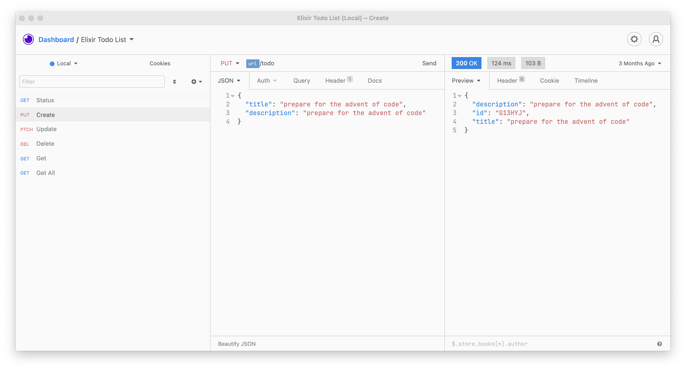

<h3 align="center">Ocean Light Theme for Insomnia</h3>

    This is the Ocean light theme plugin for <a href="https://insomnia.rest">Insomnia</a>.

## Installation

Install the `insomnia-plugin-ocean-light-theme` plugin from Preferences > Plugins.